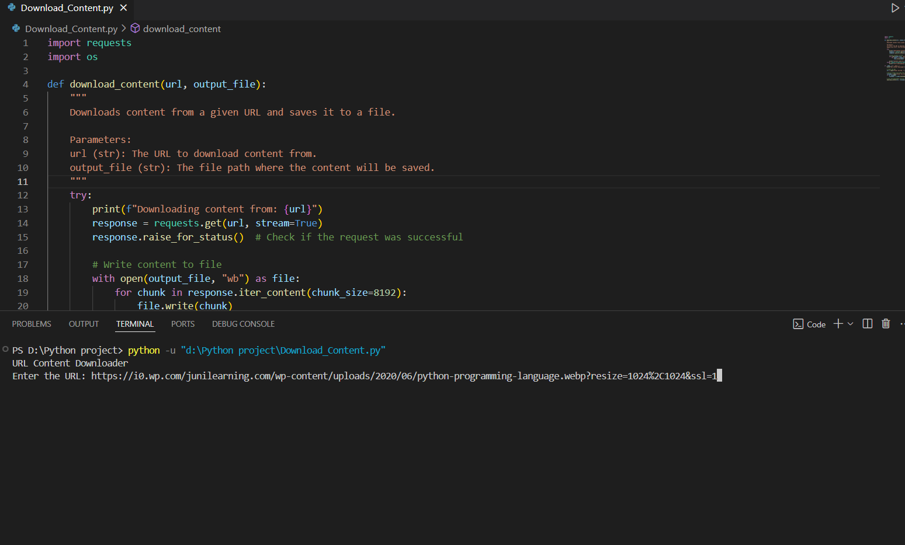
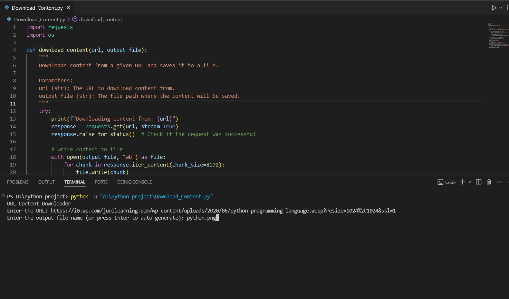
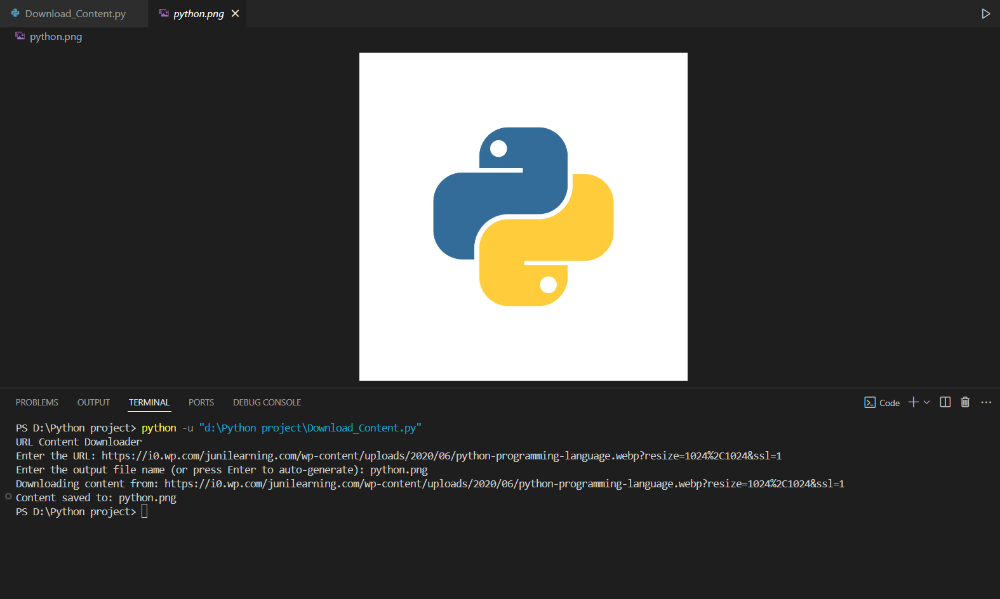

# URL Content Downloader

A simple Python script to download content (including `.jpg` and `.png` files) from a given URL and save it locally.

---

## ✨ Features

- Download any file from a given URL.
- Supports `.jpg` and `.png` file types for images.
- Handles large files with streaming to avoid memory overload.
- Auto-generates filenames from the URL (optional).

---

## ⚙️ Requirements

- Python 3.x
- `requests` library

---

## 🛠 Installation

1. Clone the repository:
   ```bash
   git clone https://github.com/rahul886297/url-content-downloader.git

2. Navigate to the folder:

```bash
cd url-content-downloader
```

3. Install dependencies:
```bash
pip install requests
```

## 🚀 Usage

1. Run the script:

```bash
python downloader.py
```

2. Enter the URL when prompted:
```bash
Enter the URL: https://example.com/image.jpg
```

3. Specify the output filename or press Enter to auto-generate:
```bash
Enter the output file name (or press Enter to auto-generate): my_image.jpg
```
The file will be downloaded and saved locally.

## 📸 Screenshots
### Enter The Url.


### Enter The Output File Name


### Content saved


**Author:** [Rahul Mandal](https://github.com/rahul886297) 

